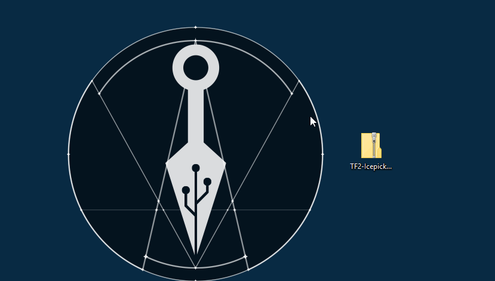
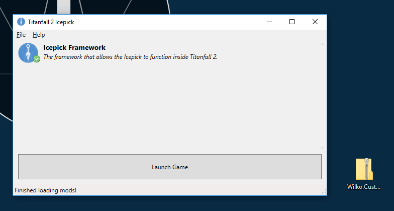

# TF|2 Icepick


-----

The home of the TF\|2 Icepick, which allows you to play with mods in the singleplayer of Titanfall 2.  

Play on any map, from the campaign or the multiplayer, create your own gauntlet races, share them with friends and race! Or make your own mods for your own way to play, and share them with the world.

# Download and Installation

1. Download and install the prerequisites listed below.
2. [Download the TF\|2 Icepick](https://www.moddb.com/games/titanfall-2/downloads/titanfall-2-icepick).
3. Extract the files in the zip archive. You can place them anywhere you like.
4. Launch Origin. You must be using the desktop version of Origin for the Icepick to work. The website version is unsupported.
5. Launch Icepick.exe, and click Launch Game to play Titanfall 2.

_**Note:** You won't be able to play Multiplayer with the Icepick enabled. Just launch the game normally to play multiplayer, or play without mods._

# Prerequisites

Users on Windows 7 may need to download the Microsoft .NET Framework 4.5 in order to run the TF\|2 Icepick. You can find the link below.

- [Microsoft .NET Framework 4.5](https://www.microsoft.com/net/download/thank-you/net452)

# Installing Save Files

1. [Download the save](https://www.moddb.com/games/titanfall-2/downloads) you want to install.
2. Open your saves folder. You can do this by opening the Icepick and clicking File > Open Saves Folder.
You can also find it in your Icepick installation folder /data/saves.
3. Extract the plaintext save file into the saves folder.
4. You can load the save in game by using the Saves tab from the Spawn Menu and selecting the name of the save you wish to load.

# Installing Mods

Mods can be easily installed by dropping the downloaded mod zip onto the Icepick launcher directly. The Icepick will install the mod automatically for you!

You can also install mods manually if the drag-drop doesn't work for you.

1. [Download the mod](https://www.moddb.com/games/titanfall-2/downloads) you want to install.
2. Open your mods folder. You can do this by opening the Icepick and clicking File > Open Mods Folder.
You can also find it in your Icepick installation folder /data/mods.
3. Extract the mod into its own folder within the mods folder.
If you've done it right you should see mods/YourCoolMod/.
4. Reload your mods list in the Icepick. You can do this by clicking File > Reload Mods List, or by restarting the Icepick.
If you installed the mod correctly, you should see it listed.

# Need Help?

Join our [Discord community](https://discord.gg/Hw3A6ZKgy7) and ask around, somebody might know how to help you with your problem, and you might meet some new friends along the way!
